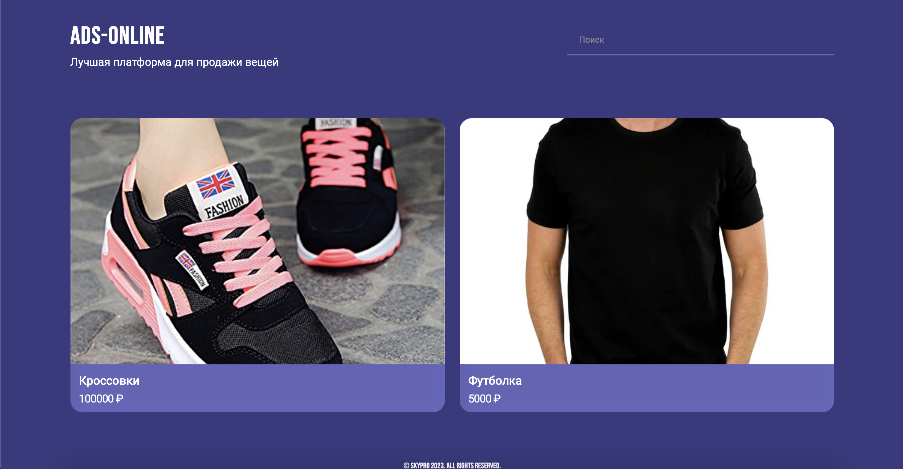
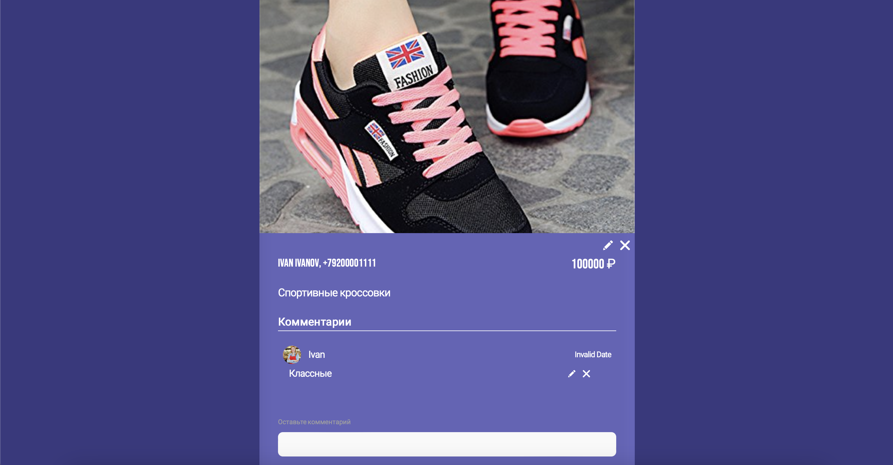

# Shopping_area

## Spring-boot приложение - платформа для продажи вещей
Под готовый [фронтенд](https://github.com/BizinMitya/front-react-avito/blob/v1.19/openapi.yaml) сайта реализована бэкенд часть проекта платформы по продаже вещей.
Пользователи могут размещать объявления товаров и оставлять комментарии к другим объявлениям.

## Функционал приложения: 
- Регистрация 
- Авторизация (распределены роли между пользователями и администраторами)
- Изменение данных в меню профиль (смена пароля, аватара, контактных данных)
- Просмотр объявлений и комментариев без авторизации
- Просмотр, редактирование, удаление объявлений и комментариев с авторизацией

## Демо проекта

## Используемые технологии

  &nbsp;
  &nbsp;
  &nbsp;
  

## Разработчики проекта:
- Дмитрий Ковачев
- Алишер Шарипов
- Алексей Охлопков
- Константин Голиков
